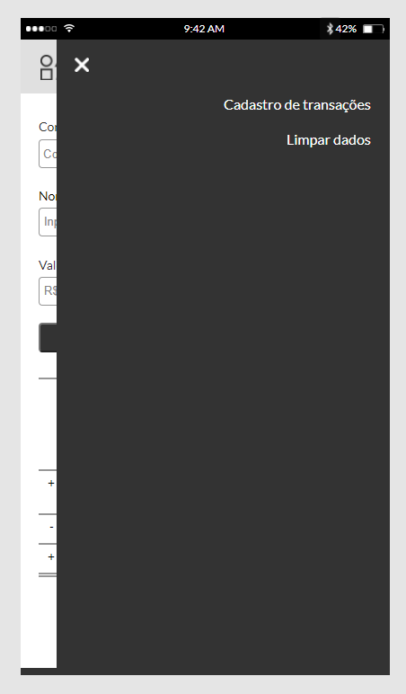

### Projeto individual do módulo *"HTML e CSS"*   
:man_technologist: Objetivo > construir uma SPA (Single Page Application) seguindo o layout proposto no Figma:  

https://www.figma.com/file/U8ojEXx2vxSK2KOvoBvHVH8y/Frontend-test?node-id=13%3A42    
  
  
🔽 *Link do projeto:*  

https://desafio-individual-newtab.netlify.app/  
    
  

### Bóra evoluir! 🚀:books: :raised_hands:
